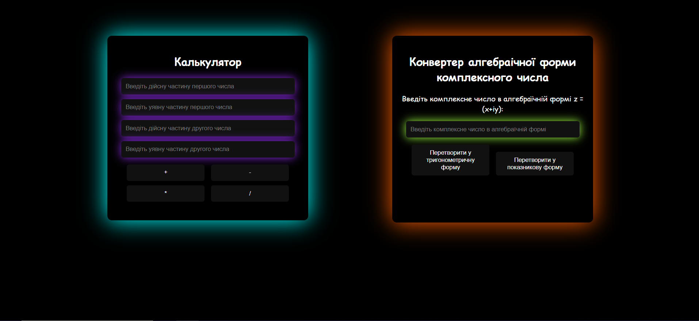

# 🧮 Complex Numbers Calculator

A simple web application for working with complex numbers.  
This project was created as a university assignment.  

## 🚀 Features
- Addition, subtraction, multiplication, and division of complex numbers  
- Conversion of a complex number from algebraic form to:
  - Trigonometric form
  - Exponential form  
- Responsive design (HTML, CSS, JavaScript only)  

## 🛠 Technologies
- HTML5  
- CSS3 (separate styles for calculator & converter)  
- JavaScript (DOM manipulation, math operations)  

## 💡 Usage
1. Enter the real and imaginary parts of two complex numbers.  
2. Choose an operation (+, −, ×, ÷).  
3. See the result displayed.  
4. Alternatively, input a complex number in algebraic form (x+iy) and convert it to trigonometric or exponential form.  

---

## 📸 Preview
  
 

## 🔗 Live Demo
👉 [Try it on GitHub Pages](https://covl21.github.io/complex-calculator/calculator.html)  
  
